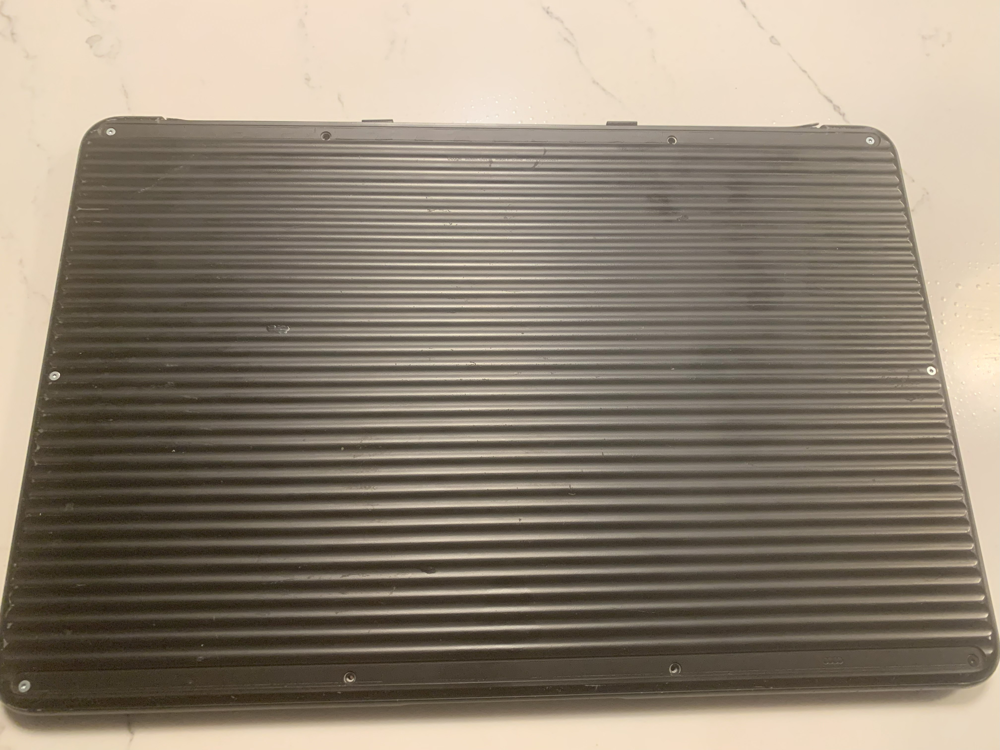

# Hackintosh-PixelbookGo
A simple, beginner friendly, guide to install macOS onto your Pixelbook Go as well as a Pixelbook.

# Credits
This repository was made with [@olm3ca](https://github.com/olm3ca)'s testing as well as [@Interstellar750](https://github.com/Interstellar750)'s EFI folder. Please give these two as much support as possible, this repository would not have been made without them.

# Prerequisites
(1.   A Pixelbook or Pixelbook Go (Duh!).

(2.   A USB flash drive with at least 8GB of free storage as well as a USB-C to USB-A adapter.

(3.   An internet connection.

(4.   A willingness that you, the user, know that flashing firmware and installing 3rd party operating systems can potentially damage or destroy your Pixelbook.

(5.   A T3 and T5 Torx screwdriver. 

(6.   Patience. For most users, it may take days, even weeks to achieve macOS on a Pixelbook. There will be a lot of trial and error.

# Device
I will be using my personal and testing Pixelbook Go for this guide. Most pictures will be from me. Some will be from other sources. You can look at CITATIONS.md for more references.

# Specifications
i5-8200Y, 16GB RAM, 128GB eMMC storage.
If your Pixelbook doesn't have these specs, don't worry. This guide should be able to get the user macOS no matter the Pixelbook model. (Unless you are using the Pixelbook 512GB model. This specific model won't work for this guide due to the fact that it uses NVMe. If you are not using NVMe, you can continue on with no problems.)

# Disabiling write-protect

If you have already disabled write-protect on your Pixelbook, you can skip this. If you haven't, keep reading.

**What is write-protect and why do we need it disabled?**

In order to install macOS onto your Pixelbook, you're going to need to flash coreboot. Coreboot is an open-source, Free Software bootloader that is aimed to change the firmware on someones computer. In this case, we are installing coreboot so that way we can remove the limitations of ChromeOS firmware. But how are we going to do it? First, we are going to need disable write-protect. What is write-protect you may ask? Well, simplified, its just a mechanism on your Pixelbook (Chromebooks in general) that is meant to stop the user from flashing any 3rd party firmware.

Before we can disable write-protect, we need to make sure developer mode is on. If it already is, you can skip this. If not enabled, keep reading.

In order to enable developer mode, turn on your Pixelbook and click the three keys circled in the picture below at once.

Once you do that, you should see this on your screen:

At this screen, 

There are two ways to disable write-protect on your Pixelbook:

(1. Temporarily disconnecting the battery and keeping it disconnected until we flash firmware (which is what we will be doing for the guide)

(2. Using a SuzyQ[able]. You can either [buy a SuzyQable](https://www.ebay.com/itm/316024978790) or [make your own](https://www.reddit.com/r/chrultrabook/comments/uaiz1q/making_a_chromeos_suzy_q_cable_tutorial/). You can use [this guide](https://github.com/yusefnapora/pixelbook-linux?tab=readme-ov-file) once you obtain the SuzyQable. Keep in mind that this guide is a bit outdated and the terminal they are using is not doable. You will have to use the terminal we will be using later on in this guide. Remember to only follow the ["Disabiling Write Protect"](https://github.com/yusefnapora/pixelbook-linux?tab=readme-ov-file) section of the guide.

In order to, temporarily, disconnect the battery on your Pixelbook, we need to do these things:

**Removing the back cover**

There will be 2 black (or white if your using a Pixelbook) strips covering the areas of the screws if you haven't opened your Pixelbook before. Remove those two black or white strips to gain access to the screws. For the Pixelbook Go, there will be 10 screws. For the Pixelbook, there will be 17 screws. You should see something like this:

Remove all the screws with your T5 Torx screwdriver. Once you remove all the screws, take off the back cover and put it down CAREFULLY. There will be a black or orange strip connecting the cover to the motherboard. It is part of the battery, and ripping it will make your Pixelbook not be able to detect power unless plugged in (Trust me, it's not fun.). The strip should look like this:

(The strip on this Pixelbook Go is broken. The back cover should be more lowered and the strip should be connected)

Next to the connected strip should be a green or yellow screw. Grab your T3 Torx screwdriver and unscrew it. Once you do that, remove the strip from the connector and re-screw the back cover.

