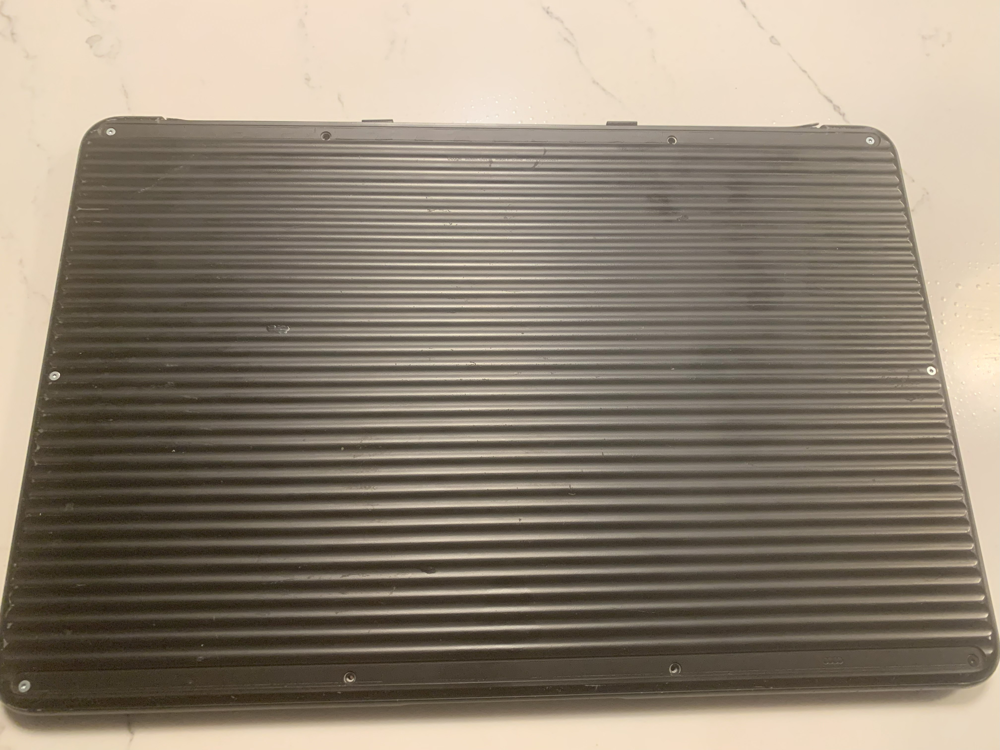

# Hackintosh-PixelbookGo
A simple, beginner friendly, guide to install macOS onto your Pixelbook Go as well as a Pixelbook.

# Credits
This repository was made with [@olm3ca](https://github.com/olm3ca)'s testing as well as [@Interstellar750](https://github.com/Interstellar750)'s EFI folder. Please give these two as much support as possible, this repository would not have been made without them.

# Prerequisites
(1.   A Pixelbook or Pixelbook Go (Duh!).

(2.   A USB flash drive with at least 8GB of free storage as well as a USB-C to USB-A adapter.

(3.   An internet connection.

(4.   A willingness that you, the user, know that flashing firmware and installing 3rd party operating systems can potentially damage or destroy your Pixelbook.

(5.   A T3 and T5 Torx screwdriver. 

(6.   Patience. For most users, it may take days, even weeks to achieve macOS on a Pixelbook. There will be a lot of trial and error.

# Device
I will be using my personal Pixelbook Go for this guide. Most pictures will be from me. Some will be from other sources, such as iFixit. You can look at CITATIONS.md for more references.

# Specifications
i5-8200Y, 16GB RAM, 128GB eMMC storage.
If your Pixelbook doesn't have these specs, don't worry. This guide should be able to get the user macOS no matter the Pixelbook model.

# Flashing the Pixelbook
If you have already flashed coreboot onto your Pixelbook, you can skip this. If you still have ChromeOS on your Pixelbook, keep reading.

In order to install macOS onto your Pixelbook, you're going to need to flash coreboot. Coreboot is an open-source, Free Software bootloader that is aimed to change the firmware on someones computer. In this case, we are installing coreboot so that way we can remove the limitations of ChromeOS firmware. But how are we going to do it? First, we are going to need disable write-protect. What is write-protect you may ask? Well, simplified, its just a mechanism on your Pixelbook (Chromebooks in general) that is meant to stop the user from flashing any 3rd party firmware. In order to disable write-protect on our Pixelbook, first shut it down and flip it onto its bottom side like this:

There will be 2 black (or white if your using a Pixelbook) strips covering the areas of the screws if you haven't opened your Pixelbook before. Remove those two black or white strips to gain access to the screws. For the Pixelbook Go, there will be 10 screws. For the Pixelbook, there will be 17 screws. Remove all the screws with your T5 Torx screwdriver. Once you remove all the screws, take off the back cover CAREFULLY. there will be a black or orange strip connecting the cover to the motherboard. The strip should look like this:

